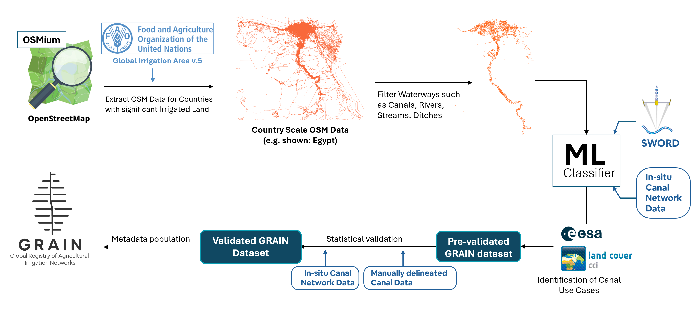

<h4> I. GRAIN Methodology </h4>

The end-to-end overview of the workflow used in the creation of the GRAIN dataset is shown in the flowchart below. The process starts with the extraction of the OSM data for countries having significant irrigated land, based on the FAO Global Irrigation Area v.5. dataset. Waterway features such as rivers, canals, stream, and drain, are then extracted from this country scale OSM data. 
  These features then serve as input to a machine learning (ML) classifier trained to distinguish man-made irrigation canals from natural watercourses. The classification is supported by in-situ canal data, SWORD river centreline dataset , and land use/land cover (LULC) information from ESA’s CCI product to identify non-agricultural channels. The output is a pre-validated canal dataset that undergoes statistical validation using both manually delineated canal maps and curated in-situ datasets from multiple regions. Finally, validated canal segments are assigned various metadata, to produce the final GRAIN dataset.

{ align=center }
<h4>II. Datasets used:</h4>

| Dataset Name | Type | Resolution | Source | Purpose in Workflow |
| :------------ | :---- | :---------- | :------ | :------------------ |
| **OpenStreetMap (OSM)** | Volunteered GIS | Vector (variable) | OpenStreetMap contributors, 2025 | Primary source for hydrographic vector features. |
| **FAO Global Irrigation Area v5** | Raster | 5 arc-min (~10 km) | Food and Agriculture Organization of the United Nations (Siebert et al., 2013) | OSM data filtering for countries with significant irrigated land. |
| **ESA CCI Land Cover v2.0.7 (2015)** | Raster | 300 m | ESA Climate Change Initiative (ESA, 2017) | Canal use-case identification. |
| **SWORD v1.5 (Surface Water and Ocean Topography River Database)** | Vector (line & node points) | ~90 m (derived from HydroSHEDS) | NASA JPL, University of North Carolina at Chapel Hill (Altenau et al., 2021) | Identifying natural river channels for training and post-process filtering. |
| **In-situ Canal Network Data** | Vector (line) | Varies by dataset | National datasets – U.S. (3DHP – NHD, USGS 2022); India Canal Dataset (Ministry of Jal Shakti, 2022); Teesta Canal Project (BWDB, Bangladesh) | Training / validation of ML classifier. |
| **Manual Canal Delineations** | Vector (line) | – | Created by authors | Validation of ML classifier. |
| **World Administrative Boundaries (ADM0)** | Vector (polygon) | – | World Food Programme, 2022; OpenDataSoft | National boundary delineation for country-based processing. |
| **SRTM (Shuttle Radar Topography Mission) DEM** | Raster | 30 m | NASA (Farr et al., 2007) | Feature engineering. |
| **HydroBasins v1.c** | Vector (polygon) | Level 5–12 basins (~100–500 km) | HydroSheds (Lehner & Grill, 2013) | GRAIN ID creation and identification of SWORD reach. |
| **Köppen–Geiger Climate Classification Map** | Raster | 5 arc-min (~10 km) | Climate Change & Infectious Diseases, Vetmed Uni Vienna (Beck et al., 2023) | Metadata. |

<h4>III. Feature Engineering for Random Forest ML Model:</h4>

GRAIN distinguishes man-made irrigation canals from natural rivers using a set of 
morphometric and topographic features derived from the OSM geometries and elevation data.
These features capture differences in geometric regularity, slope, and curvature that are 
characteristic of engineered versus natural waterways.  

Key features extracted for the classifier include:
<ul>
<li><b>Straightness ratio</b> – ratio of Euclidean distance to total length, higher for canals.  
<li><b>Slope</b> – average bed slope (m/km) from SRTM elevation profiles.  
<li><b>Elevation difference</b> – SRTM based elevation difference between start and end points of each segment.  
<li><b>Mean turning angle</b> – average deviation between successive vertices.  
<li><b>Curvature index</b> – cumulative deflection per 100 m of length.  
</ul>
These metrics collectively quantify how linear, level, and hydraulically controlled 
each waterway is, forming the basis for the Random Forest classification between 
rivers and canals.

{ align=center }

Geometric feature distributions distinguishing OSM-mapped rivers (blue) 
and canals (red). Panels (a–b) show representative examples; panels (c–g) 
illustrate the statistical contrasts in key features used for model training.

Further details on methodology can be found in the reference paper:  
📘 <b>Reference Paper:</b> 
<a href="https://essd.copernicus.org/preprints/essd-2025-488/" target="_blank">
Suresh et&nbsp;al., 2025, <i>Earth System Science Data</i> (in review)
</a> 

